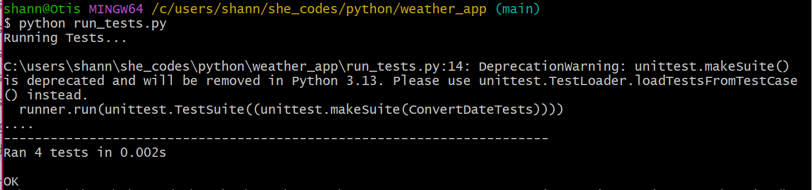
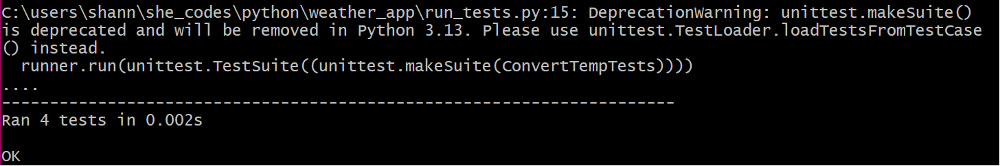
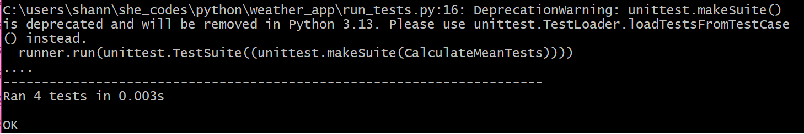
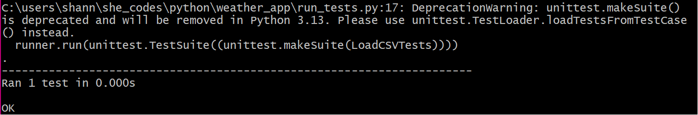
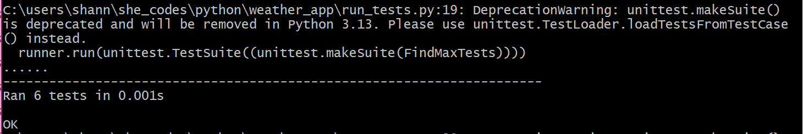
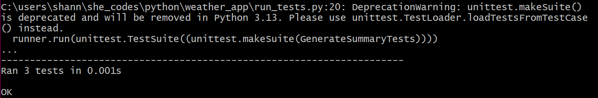
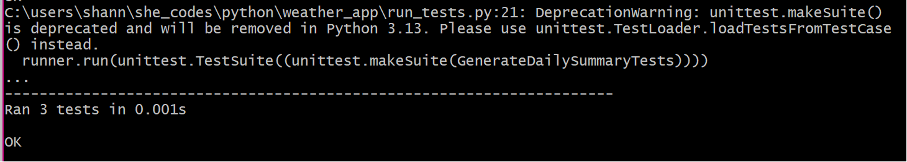

# WEATHER APP - SheCodes Plus Program Project

## Table of Contents

- [About](#about)
- [Getting Started](#getting_started)
- [Usage](#usage)

## About <a name = "about"></a>

This Python project had the class define a series of functions in order to process csv files containing data about the weather, and convert them into meaningful text-based summaries.

## Getting Started <a name = "getting_started"></a>

Some code had been provided to help get started, a copy of the original files can be located here:

https://github.com/SheCodesAus/plus-weather-project-template

### Project Requirements

```
Main Goal: To make all of the tests pass!
```
No changes allowed to anything in the tests/ directory or run_tests.py file (aside from commenting some tests out while are working to see one run at a time).

The contents of the weather.py file will be copied into a new directory and run against the original tests.

## Usage <a name = "usage"></a>

To test the code, run the run_tests.py file in the terminal.

All tests need to pass to be successful (which they do thankfully!...phew!)








